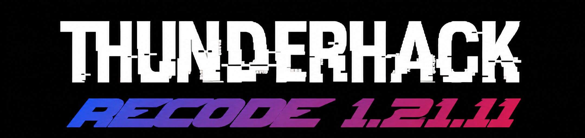

<p align="center">
    
</p>

> [!WARNING]
> It is the Fan Port (1.21.11)

## Information

- Minecraft version: ```Fabric``` 1.21.11 
- Default ClickGui keybind - **```P```** 
- Default prefix - **```@```**
- Middle click the module to bind it.
- Be aware Expensive, DoxWare 2.0, gumballoff, Treoderia "Recode", Deluxe Client, and Quick Client are both ratted and renames of this client.

## Requires these mods:

- [FabricApi 1.21.11](https://www.curseforge.com/minecraft/mc-mods/fabric-api/files/8525513)
- [Java 21+](https://www.oracle.com/java/technologies/javase/jdk21-archive-downloads.html)

## Screenshots
<details>
<summary>GUI</summary>
</details>
<details>
<summary>PVP</summary>
</details>
